

  
  <h3 align="center">Microsoft Azure IA Fundamentals - DIO e Microsoft</h3>

# 🎯Objetivo
  Esta trilha de conhecimento proporciona uma formação sólida em desenvolvimento web, ela é formada por 5 cursos que cobrem desde os fundamentos de HTML e CSS até a criação de sites completos com JavaScript. A trilha inclui cursos sobre HTML, CSS, JavaScript, integração e criação de sites utilizando essas tecnologias. Meu objetivo ao seguir essa trilha é aprimorar minhas habilidades em Front-End, capacitando-me a desenvolver interfaces web funcionais, responsivas e visualmente atraentes.

# 📚Conteúdo Abordado
  * **HTML Básico:** Este curso introduz os fundamentos essenciais do HTML, abordando as principais tags utilizadas na construção de páginas web. Como estruturar documentos HTML com semântica adequada, utilizando cabeçalhos, parágrafos, listas, links e imagens. Além disso, são apresentados conceitos de acessibilidade e boas práticas de codificação para garantir que o conteúdo seja acessível e bem-organizado.

  * **HTML Avançado:** Este curso aprofunda o conhecimento em HTML, com foco em formulários e na preparação de dados para o Back-End. O curso explora diferentes tipos de campos de entrada, como texto, e-mail, senhas, botões e selects, além de abordar a validação de dados no lado do cliente. Também são discutidas técnicas de manipulação de dados através de atributos como `name`, `value` e `action`, preparando os formulários para integração com servidores.

  * **Inovando com CSS:** Neste curso, o foco é a estilização avançada de páginas web utilizando CSS. O conteúdo aborda a aplicação de estilos de maneira eficiente, manipulando cores, fontes, margens, paddings e posicionamentos. Além disso, são introduzidos conceitos de design responsivo, como media queries, e técnicas modernas de layout, incluindo Flexbox e Grid, para criar interfaces adaptáveis e visualmente harmoniosas.

  * **HTML e CSS na Prática:** Este curso integra os conhecimentos de HTML e CSS para a construção de um site completo. Aqui a idéia é aplicar técnicas de estilização para criar um design coeso, com foco em formulários, navegação e estrutura de layout. O curso enfatiza a prática, permitindo que o desenvolvimento de um projeto real desde o início, aplicando tanto a estrutura HTML quanto as regras de estilo CSS para criar uma interface funcional e esteticamente agradável.

  * **Introdução ao JavaScript:** Este curso é uma imersão nos fundamentos do JavaScript, abordando os principais conceitos necessários para transformar páginas estáticas em interfaces dinâmicas. São exploradas variáveis, tipos de dados, operadores, estruturas de condição e repetição, funções e eventos. Além disso, o curso introduz o uso do JavaScript para processamento de dados no Front-End, com uma visão inicial sobre como o Node.JS pode ser utilizado para gerenciar interações mais complexas com o Back-End.

  * **Crie um de Site Simples com HTML, CSS e JavaScript:** Este curso combina todos os conceitos aprendidos para desenvolver um site completo e interativo. O curso é um guia do processo de construção de uma página com suporte a temas claro e escuro (light e dark mode), utilizando JavaScript para manipular o DOM e CSS para estilizar a interface. O projeto final serve como uma síntese dos conhecimentos adquiridos, permitindo aplicar e reforçar habilidades em HTML, CSS e JavaScript de maneira integrada e prática.

# 🏅Certificados
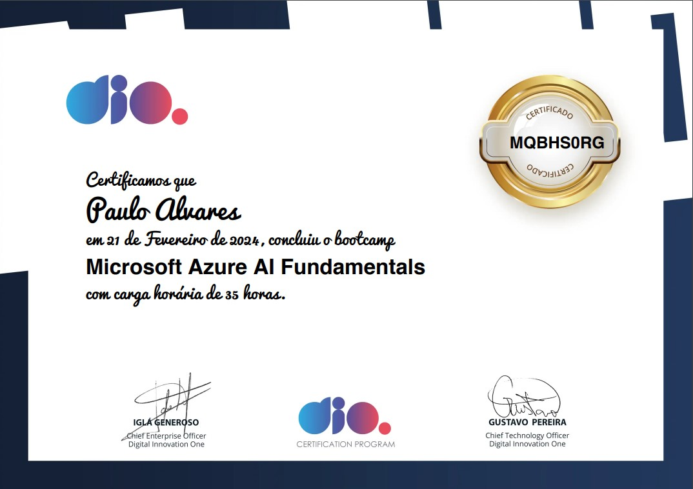

  
Princípios de IA e Desenvolvimento de Software

  

  

    
Conceitos Fundamentais de IA

    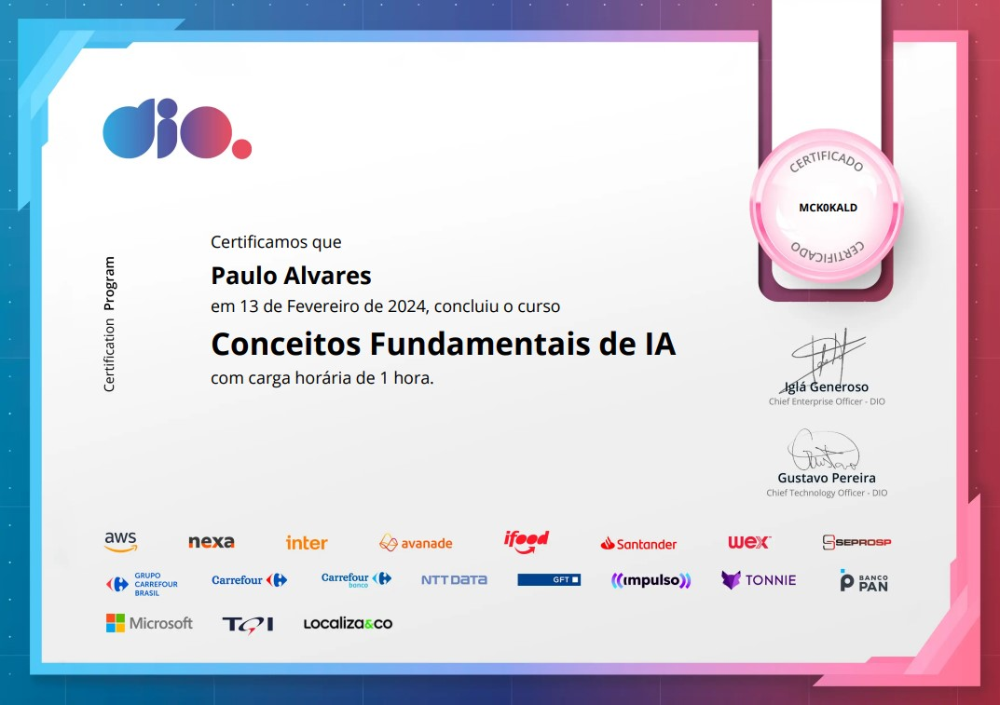
  

  

    
Versionamento de Código com Git e GitHub

    
  

  

    
Desafios de Projeto: Crie Um Portfólio Vencedor

    
  

  

    
Contribuindo em um Projeto Open Source no GitHub

    
  

  

    
Desafios de Código: Aperfeiçoe Sua Lógica e Pensamento Computacional

    
  

  

    
Aula Inaugural - Microsoft Azure AI Fundamentals

    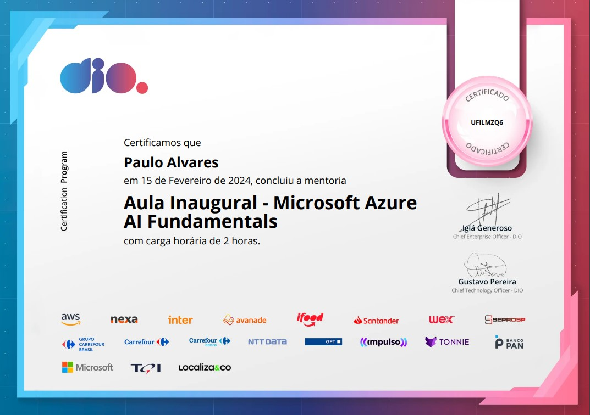
  

  
Introdução ao Aprendizado de Máquina

  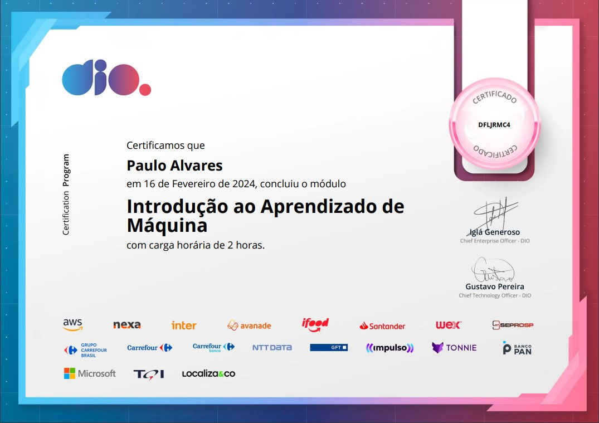

  

    
Fundamentos do Aprendizado de Máquina

    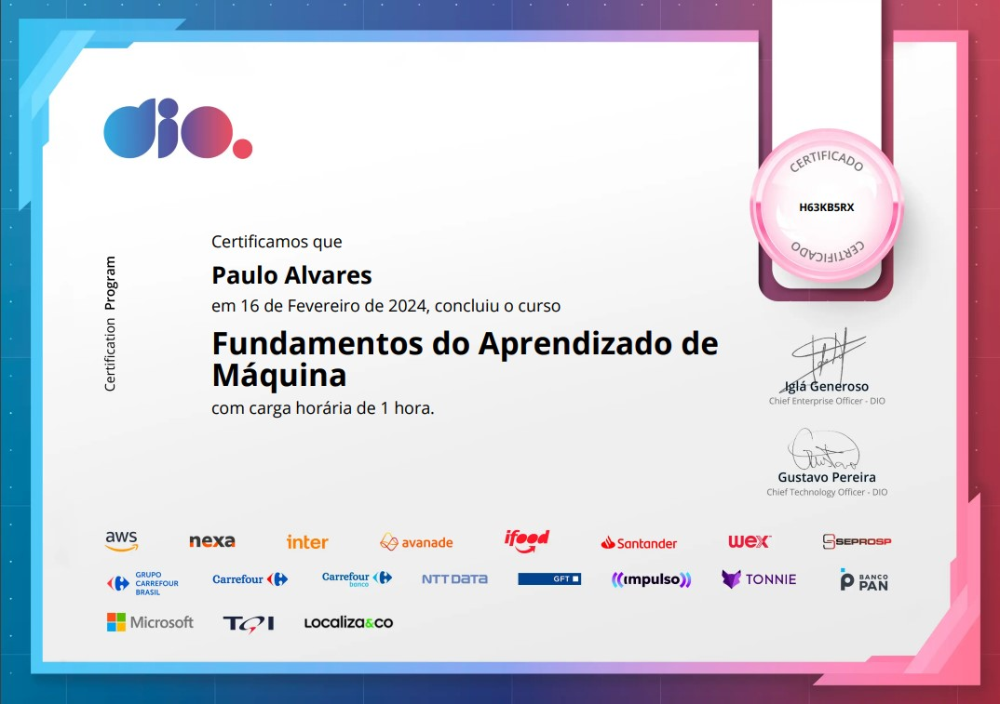
  

  

    
Trabalhando com Machine Learning na Prática no Azure ML

    
  

  
Trabalhando com Visão Computacional

  

  

    
Conceitos de Visão Computacional

    
  

  

    
Reconhecimento Facial e transformação de imagens em Dados no Azure ML

    
  

  
Processamento de Linguagem Natural

  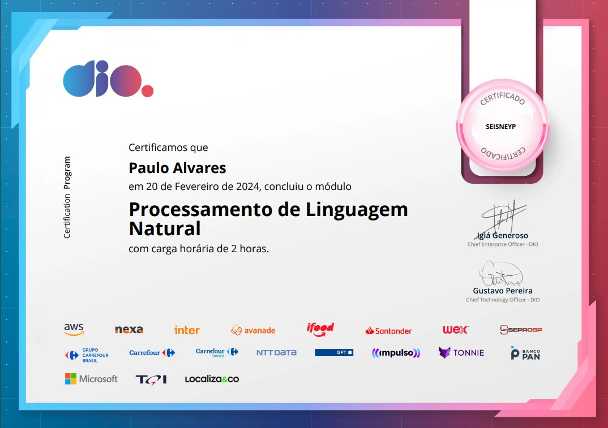

  

    
Conceitos de Processamento de Linguagem Natural

    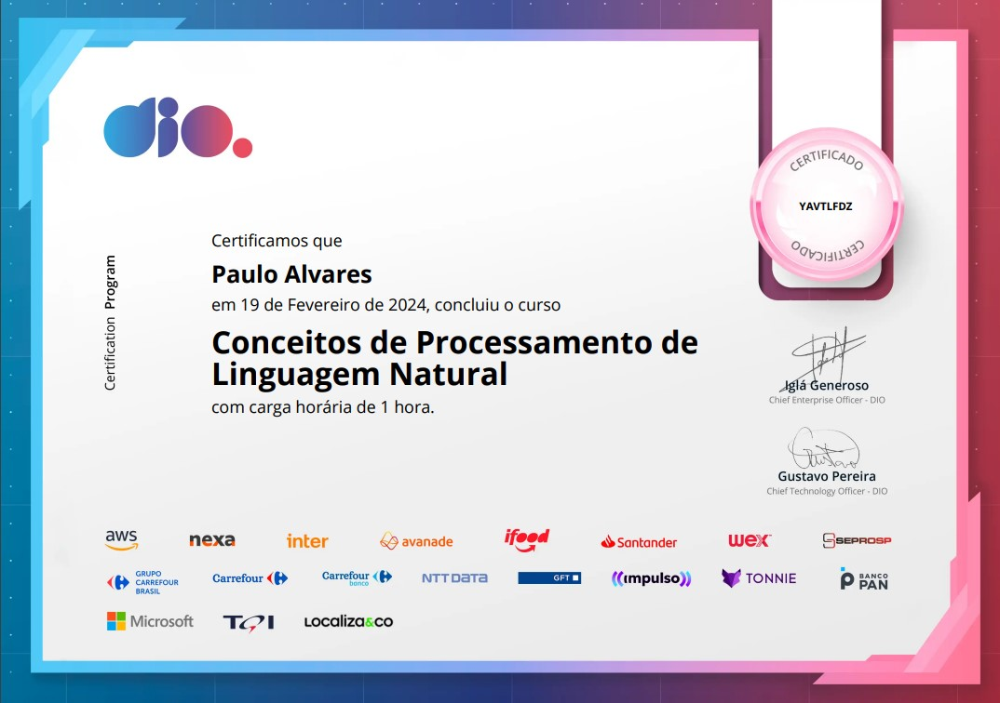
  

  

    
Análise de Sentimentos com Language Studio no Azure AI

    
  

  
Inteligência de Documentos e Mineração de Conhecimento

  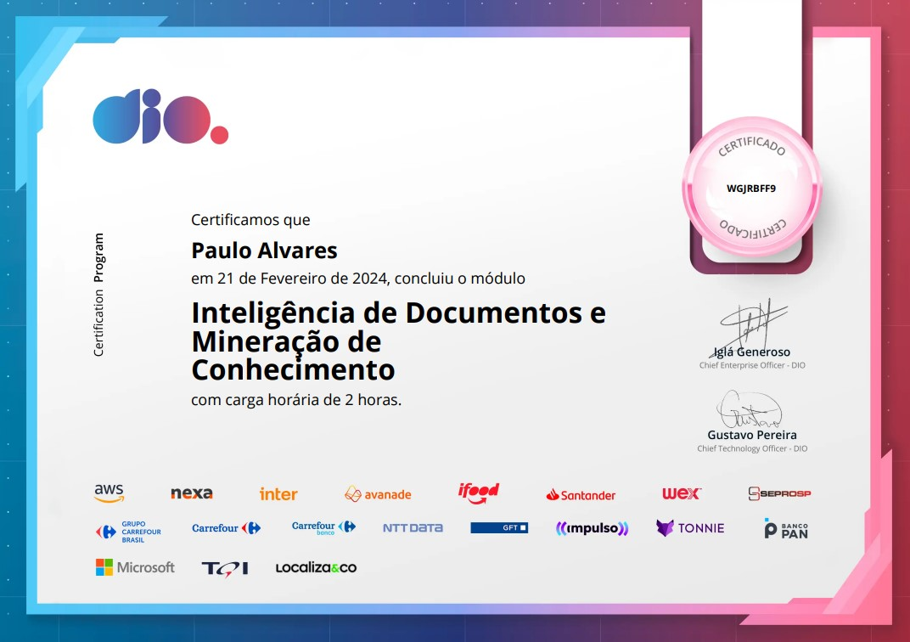

  

    
Inteligência de Documentos de IA do Azure

    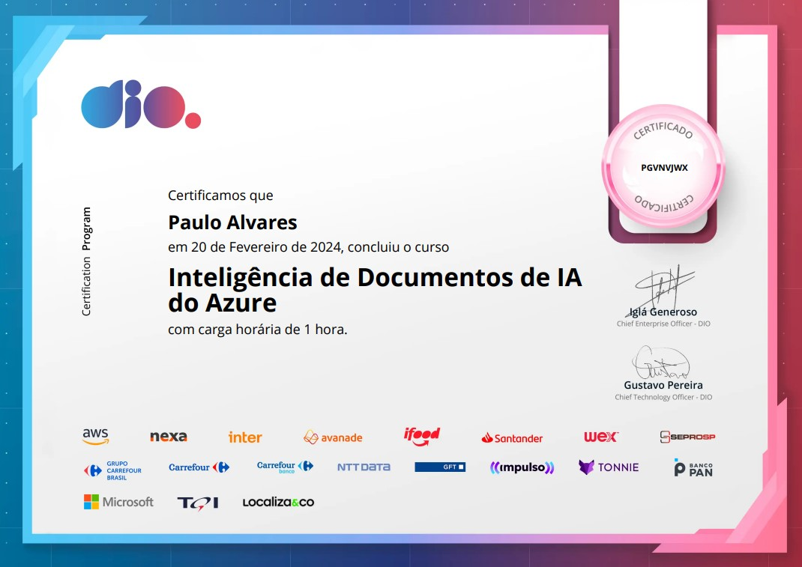
  

  

    
Azure Cognitive Search: Utilizando AI Search para indexação e consulta de Dados

    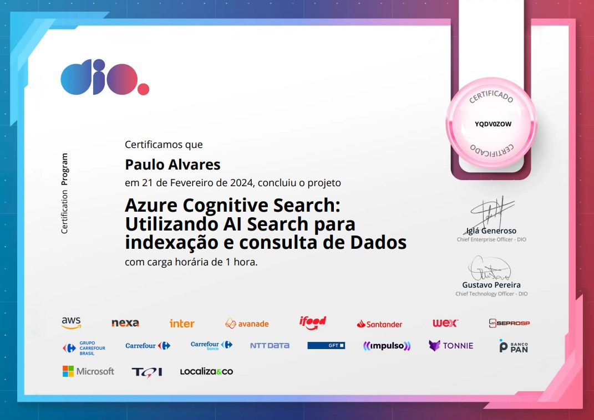
  

  
Trabalhando com IA Generativa

  

  

    
Fundamentos da IA Generativa

    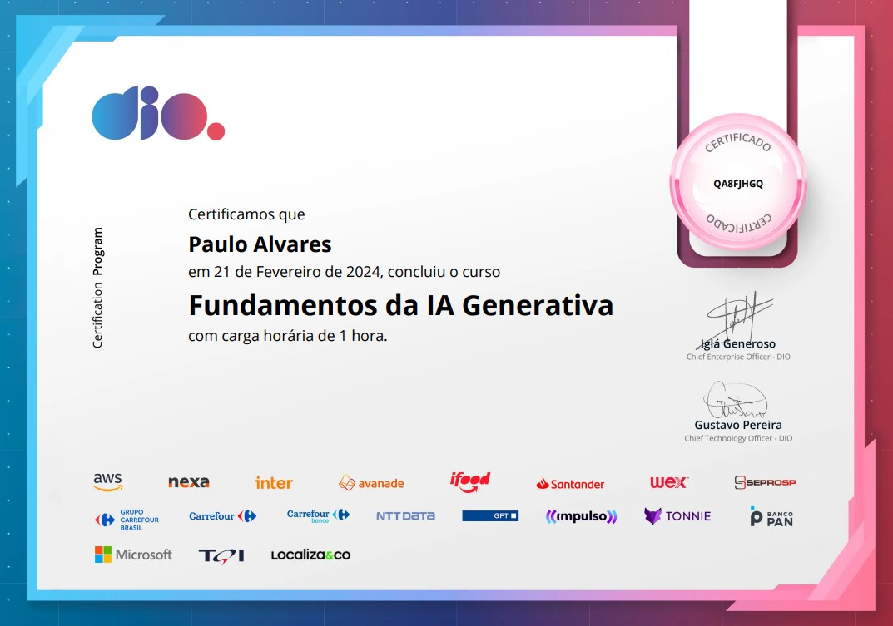
  

  

    
Fundamentos do Serviço Azure OpenAI

    
  

  

    
Explorando os Recursos de IA Generativa com Copilot e OpenAI

    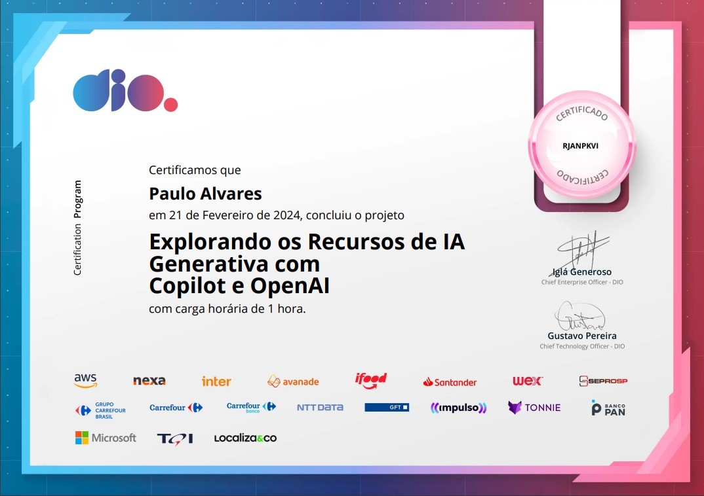
  

# 🔗Recursos Adicionais
### 🔧Ferramentas
  - <a href="https://www.sublimetext.com/download">Azure</a>
  - <a href="https://code.visualstudio.com/download">Visual Studio Code</a>

### 📖Guias de Referência
  - <a href="https://nodejs.org/docs/latest/api/">Node.Js</a>

### 📎Curso
  - <a href="https://www.ev.org.br/">Trilha: Crie Um Site Simples</a>

# 📬Contato

 
  
  
   
  
  
  

